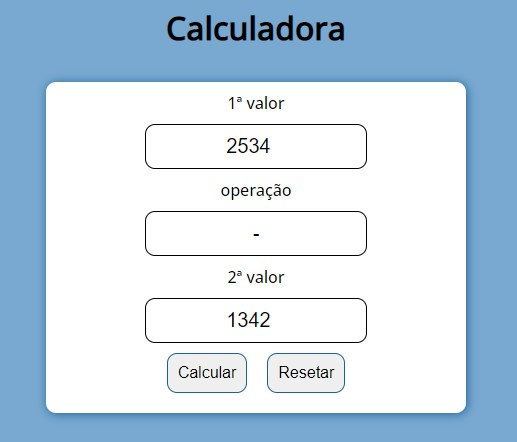

# Calculadora-javascript

## Objetivo

Praticar conhecimento em HTML, CSS e JavaScript.

## Observação

As operações aceitas são:

- Soma '+'
- Subtração '-'
- Divisão '/'
- O operador para multiplicação tem a varidade entre '\*' 'x' e 'X'
